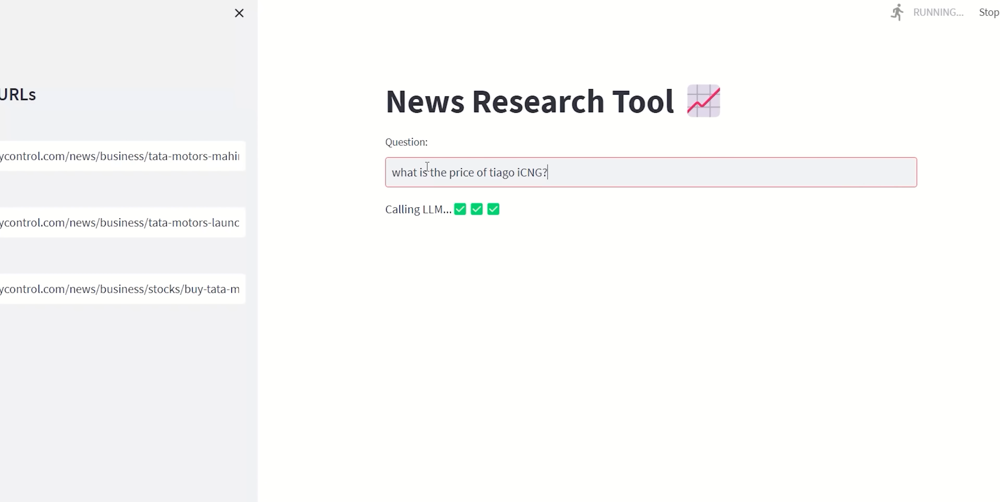

# News Research Tool


## Abstract

The News Research Tool is a sophisticated system built to provide insights and relevant information from news articles using advanced language models. By utilizing LangChain's framework in combination with OpenAI's language models and FAISS (Facebook AI Similarity Search), this tool allows users to input URLs of news articles and ask specific questions. The system retrieves the most relevant data from the articles and presents answers with supporting source links. The tool aims to assist in efficient data extraction, retrieval, and query answering in the domain of news articles.

## Objective

The primary objective of this project is to build a tool that facilitates efficient retrieval of relevant insights from a given set of news articles. By using cutting-edge NLP models and indexing techniques, the tool:

- Allows users to provide URLs of news articles.
- Loads and processes the data using LangChain and OpenAI models.
- Splits the articles into manageable chunks, embeds them, and indexes them using FAISS.
- Provides fast and accurate answers to user queries based on the content of the articles.
  
The tool aims to enhance productivity and streamline news research for users who require quick access to pertinent information from large amounts of unstructured text.

## Introduction

The News Research Tool leverages modern AI techniques to allow users to easily extract relevant data from online news articles. With the explosion of online information, it has become increasingly difficult to quickly locate specific pieces of information from lengthy articles. This tool addresses this challenge by using a combination of:

- **OpenAI’s GPT models** for processing and answering questions.
- **LangChain’s framework** for managing the entire process, from loading unstructured data (news articles) to embedding and retrieval.
- **FAISS** for efficient storage and retrieval of embeddings, enabling fast answers to user queries.

The tool is built using Python and Streamlit for the front-end interface, making it easy to input URLs and interact with the system. The system takes a URL as input, processes the news article, creates embeddings, and allows users to query the article content to extract relevant information.

## Features

- Load URLs or upload text files containing URLs to fetch article content.
- Process article content through LangChain's UnstructuredURL Loader.
- Construct an embedding vector using OpenAI's embeddings and leverage FAISS, a powerful similarity search library, to enable swift and effective retrieval of relevant information.
- Interact with the LLM (ChatGPT) by inputting queries and receiving answers along with source URLs.

## Installation

Follow these steps to get the project up and running:

1. Clone this repository to your local machine:

```bash
git clone https://github.com/arunkumar-116/news-research-tool.git
```

2. Navigate to the project directory:
```bash
cd news-research-tool
```
3. Install the required dependencies using pip:
```bash
pip install -r requirements.txt
```

4. Set up your OpenAI API key:
   -Create a .env file in the project root and add your OpenAI API key:
```bash
OPENAI_API_KEY=your_api_key_here
```
## Usage

1. To start the application:
Run the Streamlit app by executing the following command:
```bash
streamlit run main.py

```
2. The web app will open in your browser:
  -On the sidebar, you can input URLs directly or upload URLs via a text file.
  -Initiate the data loading and processing by clicking "Process URLs."
  -Observe the system as it performs text splitting, generates embedding vectors, and efficiently indexes them using FAISS.
  -The embeddings will be stored and indexed using FAISS, enhancing retrieval speed.
  -The FAISS index will be saved in a local file path in pickle format for future use.
  -Once the embeddings are created, you can input a query to retrieve relevant answers from the article data.

## Project Structure
Here is a breakdown of the project files and directories:
  - main.py: The main Streamlit application script.
  - retrieval.ipynb: A Jupyter notebook for data retrieval and processing.
  - requirements.txt: A list of required Python packages for the project.
  - faiss_store_openai.pkl: A pickle file to store the FAISS index.
  - .env: Configuration file for storing your OpenAI API key.
  - responce.jpg: Image used in the README file.


## Environment Setup
1. Create a Virtual Environment
To manage dependencies, create a virtual environment using:

```bash
python -m venv env
```
Activate the virtual environment:

On Windows:
```bash
env\Scripts\activate
```
2. Install Required Dependencies
After activating the virtual environment, install the required dependencies:

```bash
pip install -r requirements.txt
```
3. Set Up OpenAI API Key
Create a .env file in the project root and insert your OpenAI API key as follows:

```bash
OPENAI_API_KEY=your_api_key_here
```

## Code Overview
### retrieval.ipynb
- This Jupyter notebook demonstrates how to load article URLs, process the content, split the text into chunks, create embeddings using OpenAI, and store the embeddings in a FAISS vector --index for efficient retrieval.
- The notebook is used for backend data processing before the information is utilized by the Streamlit app.

### main.py
- This is the main Streamlit application script that provides a user-friendly interface.
- It allows users to input article URLs, which are processed and stored in a FAISS index for quick retrieval.
- Users can input questions to get relevant answers from the article data.

## Screenshots

- **Starting-page:**
  

- **Response:**
  


## Troubleshooting:
  - If you face issues with the OpenAI API key, ensure the `.env` file is correctly set up with your API key.
  - If you encounter errors related to FAISS, try reinstalling faiss-cpu or refer to the FAISS documentation for troubleshooting.
  - Ensure all required dependencies are installed via `pip install -r requirements.txt`.

## License(MIT License)
MIT License

Copyright (c) 2025 Arun Kumar (arunkumardsp001@gmail.com)

Permission is hereby granted, free of charge, to any person obtaining a copy
of this software and associated documentation files (the "Software"), to deal
in the Software without restriction, including without limitation the rights
to use, copy, modify, merge, publish, distribute, sublicense, and/or sell
copies of the Software, and to permit persons to whom the Software is
furnished to do so, subject to the following conditions:

The above copyright notice and this permission notice shall be included in all
copies or substantial portions of the Software.

THE SOFTWARE IS PROVIDED "AS IS", WITHOUT WARRANTY OF ANY KIND, EXPRESS OR
IMPLIED, INCLUDING BUT NOT LIMITED TO THE WARRANTIES OF MERCHANTABILITY,
FITNESS FOR A PARTICULAR PURPOSE AND NONINFRINGEMENT. IN NO EVENT SHALL THE
AUTHORS OR COPYRIGHT HOLDERS BE LIABLE FOR ANY CLAIM, DAMAGES OR OTHER
LIABILITY, WHETHER IN AN ACTION OF CONTRACT, TORT OR OTHERWISE, ARISING FROM,
OUT OF OR IN CONNECTION WITH THE SOFTWARE OR THE USE OR OTHER DEALINGS IN THE
SOFTWARE.

